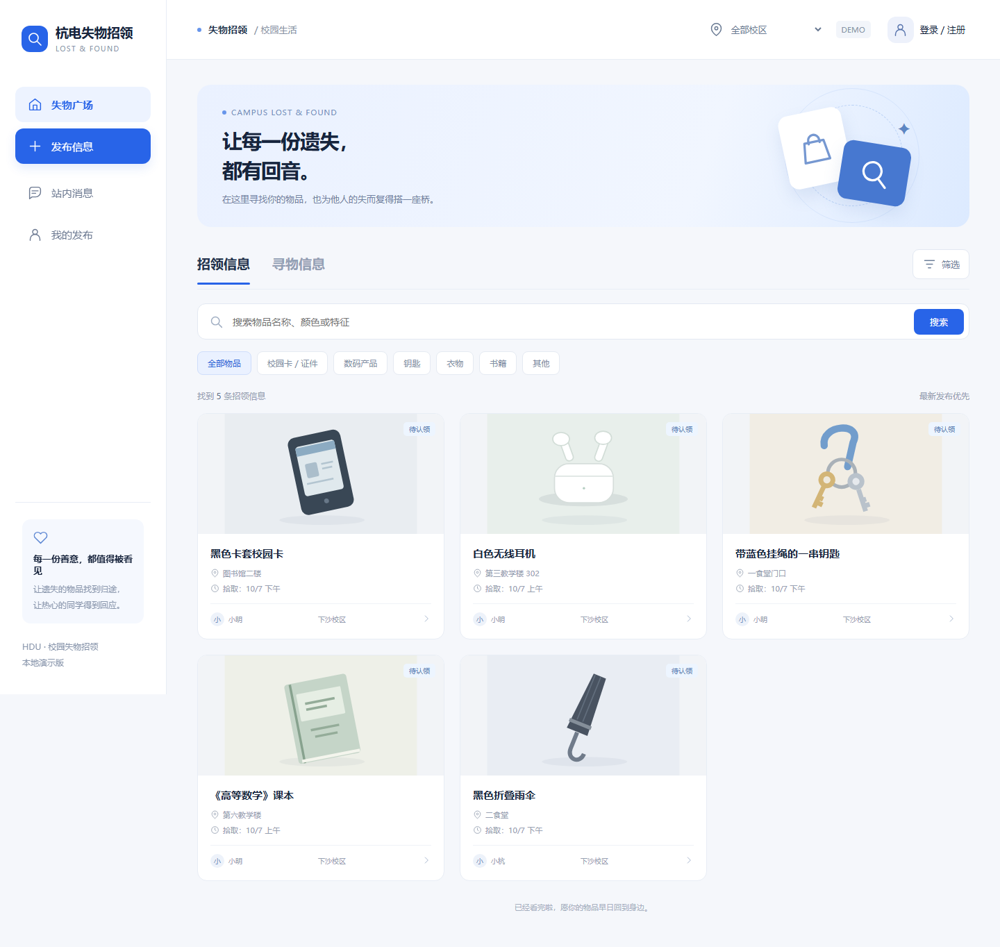
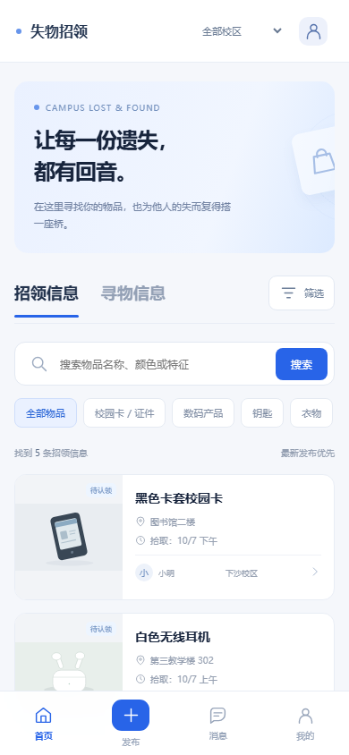
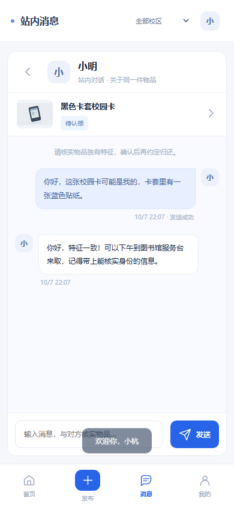

# 演示与验证
## 3分钟演示流程
1. npm start，打开首页：展示招领/寻物标签、下方搜索框、类别和校区筛选。
2. 普通窗口登录 xiaoming，发布「蓝色保温杯」招领信息，上传照片，填写拾取地点与日期。
3. 无痕窗口登录 demo，搜索「保温杯」，打开详情并点击联系发布者。
4. 双方各发一条消息，等待最多5秒展示新消息，查看消息列表和未读数。
5. xiaoming在「我的」编辑描述，确认已归还；首页默认列表不再显示该帖，在已完成筛选中找到。
6. 展示重新开启、关闭、删除；删除后详情404，已有站内聊天仍保留。
7. 刷新或重启服务，确认帖子、聊天和有效登录仍在。
## 自动验证
```powershell
npm test
```
tests/api.test.mjs：认证、权限、发帖、幂等、搜索、状态、聊天、CSRF和图片格式。
tests/edge-cases.test.mjs：SQL通配符、分页、并发更新、消息游标、单调已读、图片归属、JSON旧数据迁移、重启持久化。
## 浏览器验证
可使用已有 playwright-core 和 Chromium：
```powershell
$env:PLAYWRIGHT_MODULE="你的playwright-core目录"
$env:CHROMIUM_PATH="你的chrome或chromium可执行文件路径"
npm run test:ui
```
也可自行安装开发测试工具：npm install --no-save playwright-core，然后指定CHROMIUM_PATH。它们仅用于测试，不是运行网页的依赖。
脚本启动独立临时数据库，检查1440px桌面与390px手机、搜索筛选、登录跳转、上传发布编辑、状态、刷新持久化和双账号聊天。测试截图默认保存在临时目录，测试结束自动清理；需要保留时设置环境变量 UI_SCREENSHOT_DIR 指定输出目录。不会改动日常演示数据。
## 页面预览



