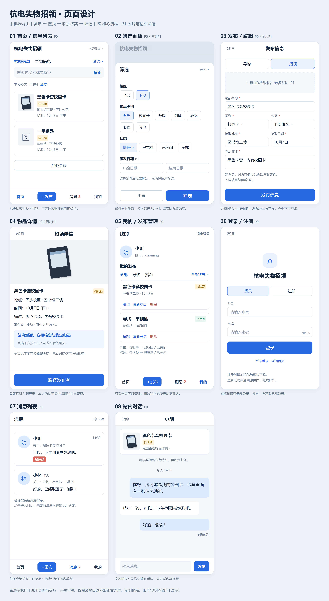

# 杭电失物招领 PRD
来源：https://zcnrodoqwrul.feishu.cn/wiki/MltKwZpDdiFrHakCqvRcSFZUnXd
同步日期：2026-10-07。以下保留飞书最新版内容；工程实现说明见 [架构说明](ARCHITECTURE.md)，接口以 [OpenAPI](openapi.json) 为准。



## 1. 产品定义
面向杭电学生的移动端失物招领平台，帮助失主找回物品、拾主找到失主。核心流程：发布信息→搜索筛选→查看详情→联系核实→归还→结束帖子。
首版为移动端网页，使用本应用独立账号注册和登录，暂不接入学校统一认证。帖子、图片、会话和消息由本应用管理。浏览和搜索无需登录；发布、收发消息及管理自己的帖子需登录。
## 2. 用户流程
- 失主：选择“招领信息”→搜索筛选→查看详情→联系拾主→核实取回；没有线索时发布寻物帖→取回后标记“已找回”。
- 拾主：选择“寻物信息”→搜索筛选或发布招领帖→联系核实→归还后标记“已归还”。
## 3. 功能
| 优先级 | 功能 | 实现范围 |
| --- | --- | --- |
| P0 | 账号 | 注册、登录、获取当前用户、退出 |
| P0 | 发布与管理 | 发布寻物／招领、查看详情、编辑和删除自己的帖子 |
| P0 | 查找 | 类型切换、关键词搜索、校区／类别／状态筛选、分页 |
| P0 | 站内消息与状态 | 站内会话、文本聊天、消息列表与未读数；标记已找回／已归还、关闭、重新开启 |
| P0 | 基础反馈 | 字段校验、空结果、失败重试、权限校验、防重复提交 |
| P1 | 图片与精细筛选 | 上传图片、图片预览、事发日期范围筛选、保管地点 |
| P2 | 扩展 | 学校统一认证、相似推荐、AI匹配、订阅提醒 |
## 4. 页面结构与布局
以390px宽手机屏幕为基准：左右留白16px，单列卡片，按钮高度至少44px；内容纵向滚动，固定底部区域不遮挡正文。示意中的方括号代表按钮或可点击项，图片功能标P1，其余页面主体为P0。
页面关系：首页→详情／筛选／发布；详情→联系发布者→站内对话；消息→会话列表→站内对话；我的→编辑／状态修改；受限操作→登录→返回原操作。
### 4.1 首页／信息列表
```
┌────────────────────────────────┐
│ 杭电失物招领           [校区 ▾] │
│ 招领信息 ●  寻物信息 ○ [筛选]  │
│ [搜索物品名称或特征…] [搜索]    │
│ 当前：下沙校区 · 进行中 [清空] │
├────────────────────────────────┤
│ [缩略图] 黑色卡套校园卡 [待认领]│
│          图书馆二楼 · 下沙校区  │
│          拾取：10月7日 下午     │
├────────────────────────────────┤
│ [默认图] 一串钥匙      [待认领] │
│          教学楼 · 下沙校区      │
│          拾取：10月7日 上午     │
│             [加载更多]         │
├────────────────────────────────┤
│ [首页 ●] [＋发布] [消息] [我的] │
└────────────────────────────────┘
```
- 首页仅保留“招领信息／寻物信息”类型标签，默认选中招领信息；搜索框放在标签下方，搜索当前选中类型的帖子。
- 点击卡片进入详情；搜索按钮或键盘搜索键提交查询。切换类型或筛选条件后从第一页加载，保留关键词。
- 默认仅进行中，按发布时间倒序，每页20条；“加载更多”追加，不重复展示。返回列表恢复搜索条件和滚动位置。
- 无结果时显示“暂未找到相关信息”及“调整筛选”“发布寻物／招领”按钮；底部导航固定。
### 4.2 筛选面板（首页底部弹层）
```
┌────────────────────────────────┐
│ 筛选                      [×] │
│ 校区     [全部] [下沙] […]      │
│ 类别     [全部] [校园卡] [数码] │
│          [钥匙] [衣物] [书籍]   │
│          [其他]                │
│ 状态     [进行中] [已完成]      │
│          [已关闭] [全部]       │
│ 日期 P1  [开始日期]—[结束日期]  │
│ [重置]                  [确定] │
└────────────────────────────────┘
```
各维度单选，条件之间取交集。确定才生效；取消不修改当前列表。重置恢复全部校区、全部类别、进行中、无日期限制。日期筛选含起止日；开始日晚于结束日时禁止确定。校区选项上线前确认，图中仅为示例。
### 4.3 发布／编辑（/posts/new、/posts/:id/edit）
```
┌────────────────────────────────┐
│ [返回]       发布信息          │
│ 类型*     [寻物 ○] [招领 ●]    │
│ 图片 P1   [＋添加，最多3张]     │
│ 名称*     [黑色卡套校园卡]      │
│ 类别*     [校园卡／证件 ▾]      │
│ 校区*     [请选择 ▾]           │
│ 地点*     [图书馆二楼]          │
│ 拾取日期* [选择日期]            │
│ 时段      [选填，如下午]        │
│ 描述*     [颜色、外观、相关情况]│
│ 保管地点  [选填，P1]            │
│ 联系方式：通过站内消息沟通       │
│ 提示：遮挡个人信息，保留核实特征│
├────────────────────────────────┤
│            [发布信息]          │
└────────────────────────────────┘
```
选择寻物时“拾取日期”改为“丢失日期”，隐藏保管地点；编辑页回填内容，类型不可修改，按钮改为“保存修改”。提交成功进入详情，失败保留内容。提交期间禁用按钮；离开未保存表单需确认。登录跳转前保留表单，登录后恢复。
### 4.4 物品详情（/posts/:id）
```
┌────────────────────────────────┐
│ [返回]       招领详情          │
│ [物品图片，左右切换，P1]       │
│ 黑色卡套校园卡       [待认领]  │
│ 类别：校园卡／证件             │
│ 拾取地点：下沙校区 · 图书馆二楼│
│ 拾取时间：10月7日 下午          │
│ 描述：黑色卡套，内有校园卡      │
│ 保管地点：图书馆服务台（示例） │
│ 发布者：小明 · 发布于10月7日   │
│ 提示：联系后请核实物品特征      │
├────────────────────────────────┤
│          [联系发布者]          │
└────────────────────────────────┘
```
- 他人的进行中帖子：点击“联系发布者”，登录后创建或复用与发布者的站内会话并进入对话页。对话顶部关联物品卡片，提示双方核实特征。
- 自己的帖子：底部显示“编辑”“更新状态”，更多菜单提供删除；不能与自己创建会话。
- 他人的结束帖子：底部显示“已找回／已归还／已关闭”，不提供联系入口。无图片时省略图片区。
- 消息发送成功显示“发送成功”，失败可重试。帖子已删除时详情显示“信息已删除”；已有对话保留并显示“物品信息已删除”。
### 4.5 我的（/me）
```
┌────────────────────────────────┐
│ 我的          昵称：小明       │
│ 账号：xiaoming       [退出登录]│
│ 我的发布   [全部] [寻物] [招领]│
│ [全部状态 ▾]                   │
├────────────────────────────────┤
│ 黑色卡套校园卡       [待认领]  │
│ 图书馆二楼 · 10月7日           │
│ [编辑] [更新状态] [删除]       │
├────────────────────────────────┤
│ 寻找一串钥匙         [已找回]  │
│ 教学楼 · 10月6日               │
│ [编辑] [重新开启] [删除]       │
├────────────────────────────────┤
│ [首页] [＋发布] [消息] [我的 ●] │
└────────────────────────────────┘
```
未登录显示“登录后管理我的发布”及登录按钮。状态弹层按类型显示“已找回／已归还”“关闭”；结束帖提供“重新开启”。每次变更需确认。删除确认提示“删除后无法恢复”；取消不产生变更。
### 4.6 登录／注册（/login、/register）
```
┌────────────────────────────────┐
│ [返回]                         │
│          杭电失物招领          │
│       [登录 ●] [注册 ○]        │
│ 账号   [请输入账号]            │
│ 密码   [请输入密码] [显示]     │
│ 注册时：昵称、确认密码         │
│             [登录]             │
│        [暂不登录，返回首页]    │
└────────────────────────────────┘
```
账号4—20位字母、数字或下划线；昵称1—20字；密码8—64位；注册确认密码须一致。注册成功自动登录。账号重复就地提示；登录失败提示“账号或密码错误”。登录成功返回站内原页面并继续原操作。
### 4.7 消息列表（/messages）
底部导航统一为“首页／发布／消息／我的”；消息入口显示未读总数，超过99显示99+。未登录进入时引导登录；无会话显示“暂无消息，先去物品详情联系发布者”。
```
┌────────────────────────────────┐
│ 消息                   2条未读 │
├────────────────────────────────┤
│ 小明                    14:32 │
│ 关于：黑色卡套校园卡           │
│ 可以，下午到图书馆取吧。  [2] │
├────────────────────────────────┤
│ 小林                     昨天 │
│ 关于：寻找一串钥匙 · 已找回    │
│ 好的，已经取回了，谢谢！       │
├────────────────────────────────┤
│ [首页] [＋发布] [消息 ●] [我的]│
└────────────────────────────────┘
```
会话展示对方昵称、关联物品、最新消息、时间和未读数，按最近活动倒序；每页20条。点击进入聊天，同一物品与同一对方只保留一个会话。没有发送过消息的会话显示“暂无消息”。
### 4.8 对话页（/messages/:conversation_id）
```
┌────────────────────────────────┐
│ [返回消息]          小明       │
│ 黑色卡套校园卡 [待认领] [详情]│
│ 提示：核实独有特征后约定归还   │
├────────────────────────────────┤
│             今天 14:30        │
│       我：卡套里有蓝色贴纸。   │
│ 小明：特征一致，下午来取吧。   │
│                我：好的，谢谢！│
│                      发送成功 │
├────────────────────────────────┤
│ [输入消息…]             [发送]│
└────────────────────────────────┘
```
- 仅提供一对一文本聊天，每条1—500字；去除首尾空白，空消息不能发送。本人消息在右，对方在左。
- 显示发送中、发送成功、发送失败；失败保留文本并允许重试，重试复用同一client_message_id，避免重复。
- 进入时加载最近30条，向上加载更早消息；新消息到达且正在底部时自动滚动，否则提示“有新消息”。
- 实际展示到某条消息后更新已读位置；仅打开列表不清空未读。返回消息列表同步刷新未读数。
- 物品卡片可返回详情；物品结束或删除后，已有会话可继续沟通，卡片显示对应状态。结束或删除帖子禁止新建会话。
## 5. 字段与数据结构
以下为首版开发约定，前后端使用同一字段名；新增及编辑均由后端再次校验。所有时间按北京时间展示，接口时间戳使用带时区的ISO 8601格式。
### 5.1 用户
User：id、account（唯一）、nickname、password_hash、created_at。密码只存安全哈希，接口不返回密码及哈希。当前用户接口返回id、account、nickname。
### 5.2 帖子
| 字段 | 规则 |
| --- | --- |
| id / owner_id | id 服务端生成；owner_id 从登录会话取得，不接受前端指定 |
| type | LOST（寻物）／FOUND（招领），创建后不可变 |
| title / category | title 必填，2—30字；category：CARD、DIGITAL、KEY、CLOTHING、BOOK、OTHER |
| campus_id / location | campus_id 必填，校区字典ID；location 必填，2—50字 |
| event_date / event_period | event_date 必填，YYYY-MM-DD，不得晚于北京时间当天；event_period 选填，最多30字，未知时留空，不强制填写准确时刻 |
| description / storage_location | description 必填，5—300字；storage_location 仅招领可填，最多100字，P1 |
| 会话关联（独立表） | 发帖无需填写外部联系方式；首次联系后创建会话，以post_id关联双方用户，见5.4节 |
| image_ids | 选填，最多3个本人上传的图片ID，P1；无图片使用默认缩略图 |
| status / deleted_at | status：OPEN（进行中）、RESOLVED（成功结束）、CLOSED（主动关闭）；deleted_at 删除时间，默认空 |
| created_at / updated_at / version | created_at、updated_at 服务端生成；version 每次编辑及状态变更递增，用于并发校验 |
显示规则：LOST＋OPEN＝寻找中，FOUND＋OPEN＝待认领；LOST＋RESOLVED＝已找回，FOUND＋RESOLVED＝已归还；CLOSED＝已关闭。
联系采用站内消息，帖子不存微信或QQ字段；会话和消息只向参与双方开放。
### 5.3 发布及编辑校验
- 必填项缺失、长度超限、非法枚举和未来日期均拒绝提交，错误定位到对应字段。
- 校区从服务端字典选择，不依赖写死的校区名称；保管地点不得用于寻物帖。
- 图片支持JPG、PNG，每张最多10MB；前后端均检查大小和实际文件类型。上传成功才可提交图片ID，失败允许重试或移除。
- 发布前提示遮挡完整姓名、学号等个人信息；拾主保留独有特征用于双方核实。
### 5.4 会话与消息
| 数据结构 | 字段 | 说明 |
| --- | --- | --- |
| Conversation | id、post_id、initiator_id、owner_id、created_at、last_activity_at | 唯一约束(post_id, initiator_id, owner_id)，owner_id取帖子作者；前端不能指定任意收件人 |
| Message | id、conversation_id、sender_id、content、client_message_id、created_at | sender_id取登录用户；唯一约束(sender_id, client_message_id)，用于发送重试去重 |
| ConversationRead | conversation_id、user_id、last_read_message_id | 双方分别保存已读位置；未读数只统计对方在该位置之后发送的消息 |
## 6. 状态、权限与异常
- 创建帖子默认OPEN。仅作者可执行OPEN→RESOLVED、OPEN→CLOSED、RESOLVED／CLOSED→OPEN；成功结束与关闭之间不直接切换。
- 只有本人可编辑和删除；后端校验身份，不以按钮是否显示作为权限判断。
- 帖子软删除后不再展示，详情返回404，禁止创建新会话；已有会话和消息保留并可继续沟通。重新开启不恢复已删除帖子。
- 本人可编辑结束帖子，但不改变状态；列表及详情刷新后同步显示新内容。
- 创建会话要求已登录、帖子未删除且为OPEN；结束或删除帖子不能创建新会话，已有会话可继续沟通。查看及发送消息不改变帖子状态。
- 提交期间禁用按钮；创建接口使用幂等键，相同用户及相同键重试返回同一帖子。修改和状态变更携带version，版本过期返回409并提示刷新。
- 登录失效返回401，保留非敏感表单内容并跳转登录；退出使登录会话失效并清除本地缓存的聊天内容和未读数。
- 空列表显示引导，加载失败提供重试；筛选及分页请求只采用最近一次查询结果，避免旧结果覆盖新结果。
### 6.1 消息权限与同步
- 点击自己的帖子不能发起会话；不在会话中的用户不能读取或发送消息。双方沟通不自动修改物品状态。
- 首版在网页可见时每5秒轮询未读数与当前会话增量消息；切换页面后停止对应轮询，离线或失败显示重试，恢复时继续增量拉取。消息按id去重。
- 所有消息接口必须登录并验证会话参与者；消息内容按纯文本展示，禁止执行HTML。未登录返回401，非参与者返回403。
## 7. 接口约定
P0接口如下，路径与字段为本项目约定。登录采用服务端Session和HttpOnly Cookie，前端跨请求携带Cookie；写操作由后端校验CSRF令牌，退出销毁会话。
```
POST   /api/auth/register       注册并建立会话
POST   /api/auth/login          登录并建立会话
GET    /api/auth/me             获取当前用户
POST   /api/auth/logout         退出并销毁会话
GET    /api/campuses            获取校区选项
GET    /api/posts               搜索、筛选及分页
POST   /api/posts               创建帖子
GET    /api/posts/:id           公开物品详情
PATCH  /api/posts/:id           作者编辑，携带version
DELETE /api/posts/:id           作者删除，携带version
PATCH  /api/posts/:id/status    作者改状态，status＋version
POST   /api/posts/:id/conversations  创建或复用站内会话
GET    /api/me/posts            我的帖子，按type、status筛选
```
P1接口：POST /api/images上传图片，返回image_id、url；图片预览使用返回地址，帖子只引用本人上传的图片。
- 注册请求：account、nickname、password；登录请求：account、password。
- 创建请求：type、title、category、campus_id、location、event_date、event_period、description；P1补充image_ids、storage_location。编辑使用同名字段，不允许修改type、owner_id。
- 列表查询：type、keyword、campus_id、category、status、page、page_size；P1增加date_from、date_to。默认status=OPEN、page=1、page_size=20，上限50；status=ALL时包含结束帖。关键词匹配名称或描述，其余条件取交集，日期匹配event_date且包含起止日。
- 列表返回items、total、page、page_size、has_more；以created_at倒序、id倒序稳定排序，加载时按id去重。
- 列表卡片返回id、type、title、category、campus_id、campus_name、location、event_date、event_period、status、cover_url、created_at；详情另返回描述、图片、保管地点、发布者id及昵称、updated_at、version。
- 创建会话接口返回conversation_id，并进入聊天页；我的发布分页格式与公共列表一致，仅返回当前用户未删除的帖子。
- 成功返回data；失败返回code、message、field_errors（字段错误时提供）。HTTP状态：400参数错误，401未登录，403无权限，404不存在／已删除，409状态或版本冲突、账号重复。
### 7.1 站内消息接口
```
POST /api/posts/:id/conversations       创建或复用会话
GET  /api/conversations                 会话列表与未读总数
GET  /api/conversations/:id/messages    历史或增量消息
POST /api/conversations/:id/messages    发送文本
POST /api/conversations/:id/read        更新已读位置
```
- 创建会话无须传收件人；返回conversation_id。本人联系返回400，帖子结束返回409，删除返回404；只有OPEN帖子允许创建或从详情进入会话，历史会话从消息列表进入。
- 列表参数page、page_size；返回items、total、unread_total。每项含id、对方id及昵称、物品摘要及状态、last_message、last_activity_at、unread_count。
- 消息查询limit默认30、上限100；before_id查更早消息，after_id查增量，二者互斥。id按服务端单调递增；响应items按id升序，含next_cursor、has_more。历史请求与增量请求分别维护游标。
- 发送请求content、client_message_id；返回已保存消息。服务端持久化成功后才显示发送成功。已读请求last_read_message_id，必须属于该会话；已读位置只能前移。
## 8. 验收标准
- 失主可搜索招领帖、发布寻物帖、与拾主站内对话并标记已找回；拾主可发布招领帖并标记已归还。
- 注册、登录、获取当前用户和退出均可用；登录后返回原操作，表单不丢失。
- 必填、长度、日期校验生效；无图片可以发布；重复提交只创建一条帖子。
- 搜索、筛选和分页可组合使用；默认不展示结束帖，返回列表恢复条件及位置。
- 他人即使直接调用接口也不能编辑、删除和改状态；非会话参与者不能读取或发送消息；结束帖不能创建新会话。
- 状态修改、重新开启、编辑及删除后，各页面显示一致；并发修改不会静默覆盖。
- 设计稿覆盖八类页面及无结果、字段错误、加载失败、已结束、已删除状态；完整演示“发布招领→失主搜索→联系核实→归还→结束帖子”。
- 从详情联系能进入站内对话；同一对象和帖子重复点击不产生重复会话；发送重试不产生重复消息；双方刷新后可看到历史消息；未读数随新消息和已读位置正确变化；非参与者无法访问；帖子结束或删除后禁止新建会话，已有会话仍可沟通。
## 9. 开发顺序
- P0：首版必须完成，先实现账号、帖子发布管理、查找、站内消息与状态，确保流程可用。
- P1：P0完成后补充图片、日期筛选和保管地点；P0与P1共同构成本次设计范围。
- P2：学校统一认证及其他扩展后续考虑；校方接口、权限和测试条件明确后再接入，不影响首版验收。
